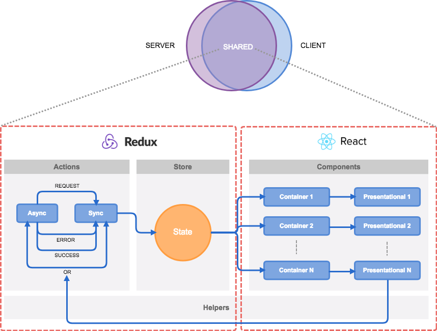
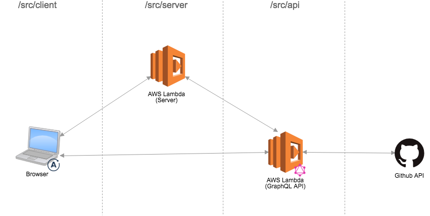

Repos<br>
[](https://travis-ci.org/lquixada/repos)
[](https://codecov.io/gh/lquixada/repos)
[](https://opensource.org/licenses/MIT)
================

An explorer app for Facebook projects in Github.


## Installation

```
$ git clone https://github.com/lquixada/repos.git
$ cd repos
$ curl -o- https://raw.githubusercontent.com/creationix/nvm/v0.33.11/install.sh | bash
$ nvm install
$ nvm use
$ yarn
```


## Getting Started

In order to run the app, you will need a token from Github API. Please follow [these instructions](https://help.github.com/articles/creating-a-personal-access-token-for-the-command-line/) to get one if you don't have it yet. Then, on your root folder, run:

```
$ cat > .env <<EOL
WEB_PORT = 3000
API_PORT = 3001
GITHUB_ACCESS_TOKEN=<your github token here>
EOL
$ yarn start
```

And go to http://localhost:3000/. Please note that in dev mode bundles will be served from memory whereas in prod mode it will be served from disk.

To run all specs and lints, run:

```
$ yarn test
```


## Other commands

* **yarn pm2 start**: starts a webserver and an graphql api aimed for development
* **yarn pm2 logs**: logs every output from both the webserver and the graphql api
* **yarn pm2 kill**: stops the webserver and the graphql api


## Pages

* **/**: that's the main page.
* **/r/:repo**: a repository page. For instance: /r/react.
* **/about**: a little about my professional thinking (it can be also accessed through the footer link)


## Architecture




## Folder Structure

* **dist/**: distributable files for the web (server and client) created through `yarn build`
* **docs/**: assets for the README file
* **logo/**: editables for the project logo
* **src/**: all source files
  * **__tests__**: all that is needed to setup for the test suites
	* **api/**: entry point for the graphql api
	* **client/**: entry point for the browser app
	* **public/**: assets files such as images
	* **server/**: entry point for the web server
	* **shared/**: common codebase for both client and server (95% of the code is here)
* **tasks/**: shell tasks that are big enough to not be a npm task
* config files will be on the root folder


## Infrastructure




## Stack

* **App**: react, redux, redux-saga, react-router, apollo client/server, graphql
* **Style**: styled-components
* **Tests**: jest
* **Lint**: standard
* **Utils**: npm, webpack, babel
* **CI**: [TravisCI](https://travis-ci.org/lquixada/repos/) (tests and deployments)
* **Infra**: [AWS Lamba](https://aws.amazon.com/lambda/)


## License

repos is licensed under the [MIT license](https://github.com/lquixada/repos/src/master/LICENSE) © [Leonardo Quixadá](https://twitter.com/lquixada/)


## Author

|[](https://github.com/lquixada)|
|:---:|
|[@lquixada](http://www.github.com/lquixada)|
